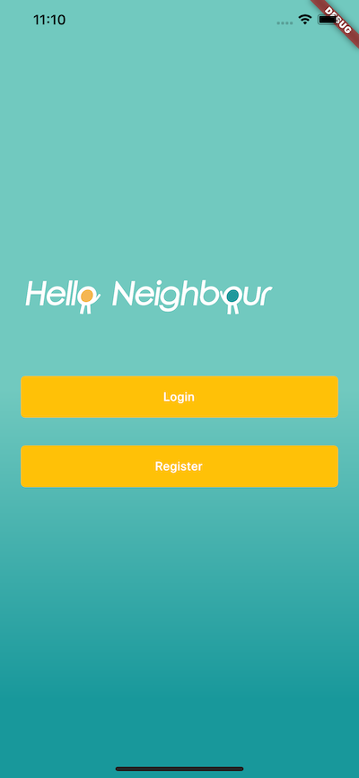
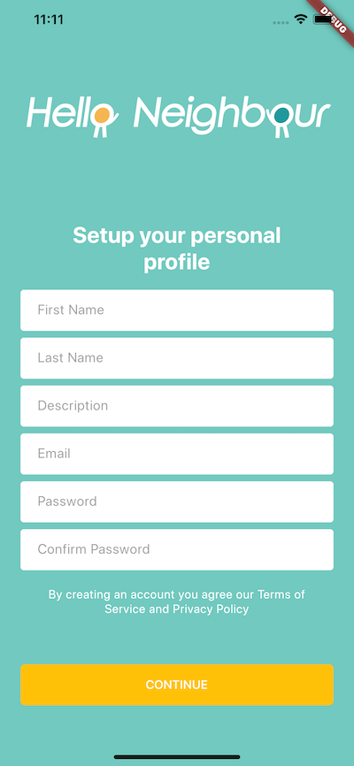
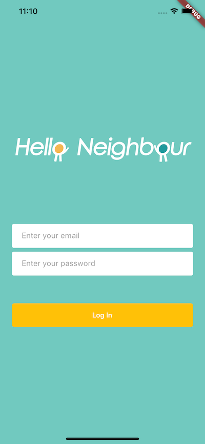
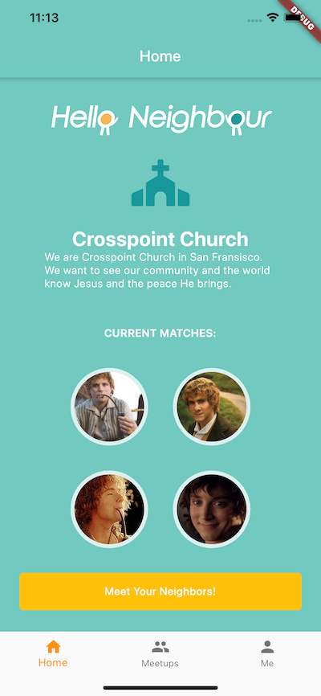
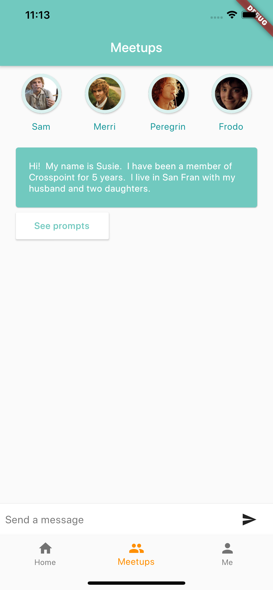
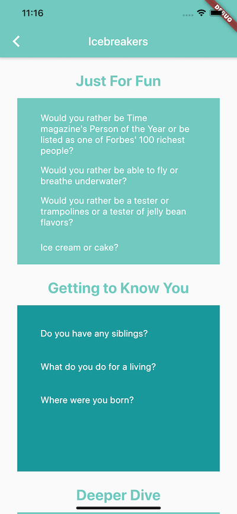

# Hello Neighbor
#covidhack Faithtech Hackathon - Team Interconnect

An app to bring church members closer together.

## Design
[xd design](https://xd.adobe.com/view/9d3b8b7b-bc00-4448-5a26-9e4d9f150fe7-eb0a/)

## Backend
[UpstreamCode/interconnect-backend](https://github.com/UpstreamCode/interconnect-backend)

## Screenshots

        

        

## Contribution Guide:
Push flow as follows:
1. Make all changes on a branch, ex. `new-profile-page`
2. Create pull request to `Master`
3. Wait for review, if possible, otherwise directly merge
4. Merge to `Master`
5. Delete branch
