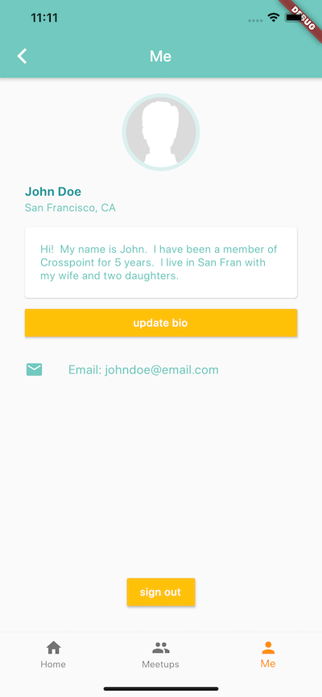

# interconnect_mobile_app
#covidhack Faithtech Hackathon - Team Interconnect

## Contribution Guide:
Push flow as follows:
1. Make all changes on a branch, ex. `new-profile-page`
2. Create pull request to `Master`
3. Wait for review, if possible, otherwise directly merge
4. Merge to `Master`
5. Delete branch

        

        

